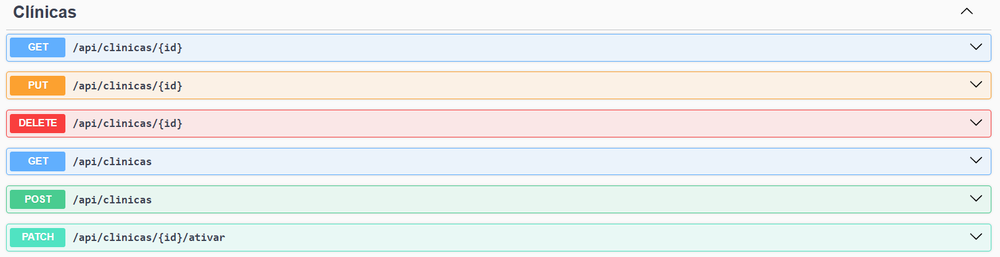
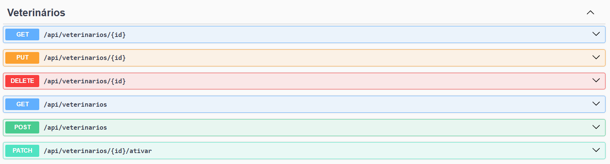
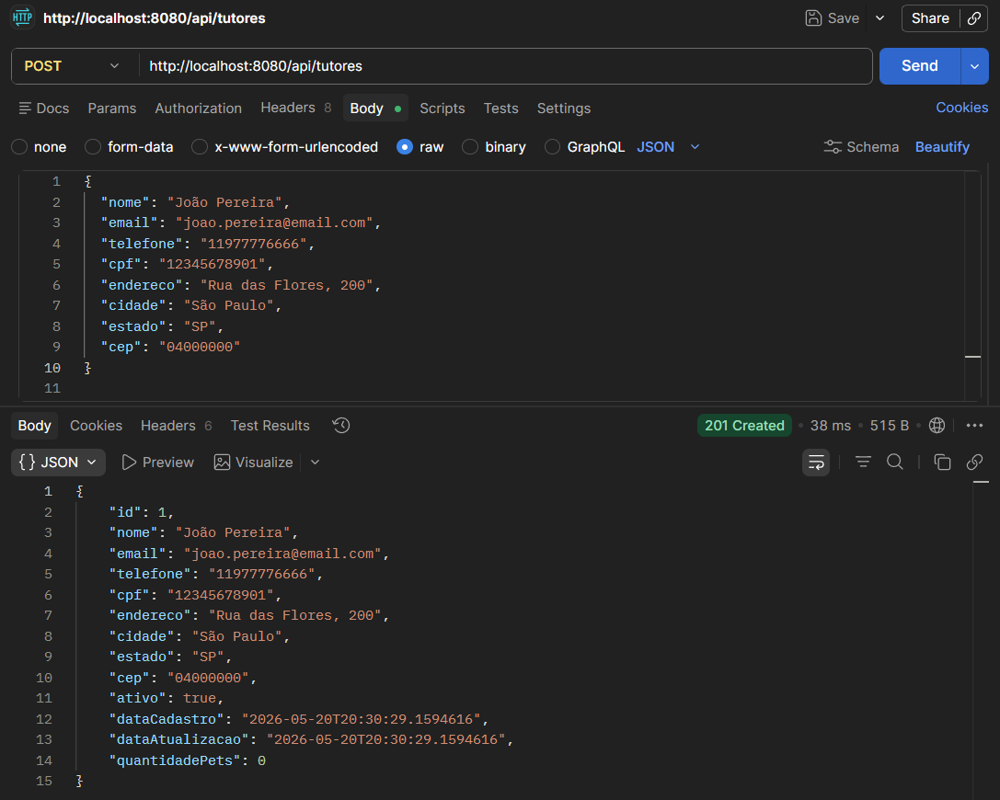
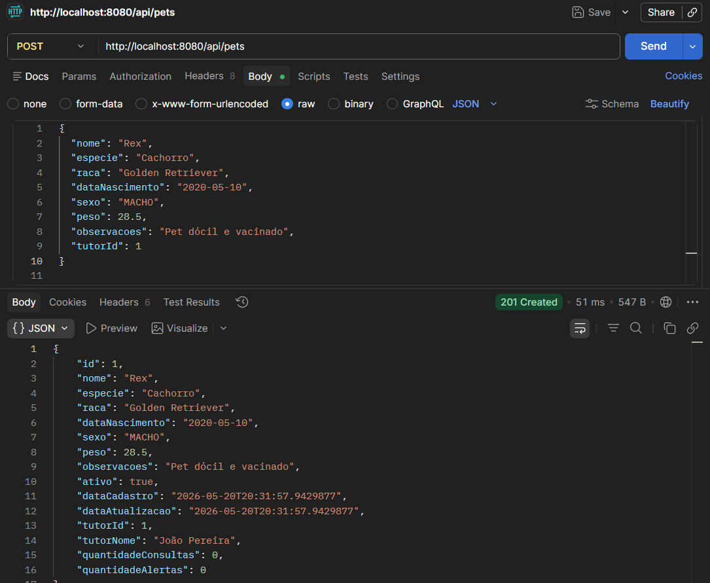
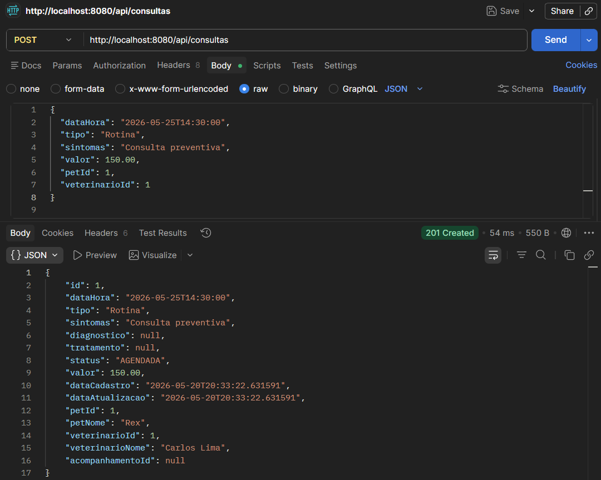

# Clyvo VitalPet API

API REST desenvolvida em **Java 17 + Spring Boot** para atender aos requisitos da entrega de **Java Advanced** e **DevOps Tools & Cloud Computing**.

A solução simula uma plataforma para clínicas veterinárias acompanharem pets após consultas, gerando alertas de retorno e oferecendo um dashboard com indicadores principais. Assim, o projeto vai além de um CRUD simples e aplica regras de negócio dentro do contexto proposto.

## Requisitos atendidos em Java Advanced

- Aplicação Java com Spring Boot.
- Persistência em SGBD relacional com H2.
- Entidades relacionadas e mapeadas com JPA.
- Programação Orientada a Objetos com separação por camadas.
- Controllers RESTful.
- Services com regras de negócio.
- Repositories com Spring Data JPA.
- DTOs para entrada e saída de dados.
- Validação de campos com Bean Validation.
- Paginação de resultados.
- Ordenação de resultados.
- Busca com parâmetros.
- Cache para otimização de consultas.
- Tratamento global de erros e exceções.
- Documentação com Swagger/OpenAPI.
- Collection do Postman para testar os endpoints.

## Requisitos atendidos em DevOps

- Conteinerização com **Dockerfile**.
- Execução **sem Docker Compose**.
- Banco H2 conteinerizado usando a imagem `oscarfonts/h2:2.2.224`.
- API Spring Boot rodando em container próprio.
- Containers executando em background com `docker run -d`.
- Volume nomeado `vitalpet-h2-data` para persistência do banco.
- Rede Docker `vitalpet-network` para comunicação entre API e banco.
- Aplicação rodando com usuário sem privilégios administrativos (`appuser`).
- Script Azure CLI para criar VM Linux, abrir portas, instalar Docker, clonar projeto e subir containers.
- Script de remoção da VM e recursos em nuvem.
- Arquitetura macro documentada em `docs/arquitetura-devops.mmd`.

## Tecnologias

- Java 17
- Spring Boot 3.3.5
- Spring Web
- Spring Data JPA
- Bean Validation
- Spring Cache
- H2 Database
- Springdoc OpenAPI / Swagger
- Maven
- Docker
- Azure CLI
- Azure VM Linux

## Como executar localmente sem Docker

Abra o projeto no IntelliJ e rode a classe:

```text
src/main/java/com/clyvo/vitalpet/ClyvoVitalpetApplication.java
```

Ou execute pelo terminal:

```bash
mvn spring-boot:run
```

A API iniciará em:

```text
http://localhost:8080
```

## Como executar localmente com Dockerfile

Na raiz do projeto, execute:

```bash
chmod +x scripts/run-containers-dockerfile.sh
./scripts/run-containers-dockerfile.sh
```

O script executa estes passos:

```bash
docker network create vitalpet-network
docker volume create vitalpet-h2-data
docker run -d --name vitalpet-h2 --network vitalpet-network -p 8082:81 -v vitalpet-h2-data:/opt/h2-data oscarfonts/h2:2.2.224
docker build -t vitalpet-api:1.0.0 .
docker run -d --name vitalpet-api --network vitalpet-network -p 8080:8080 vitalpet-api:1.0.0
```

Acesse:

```text
API:      http://localhost:8080
Swagger:  http://localhost:8080/swagger-ui.html
H2 Web:   http://localhost:8082
```

Configuração no H2 Console:

```text
JDBC URL: jdbc:h2:tcp://localhost:1521/./vitalpetdb
User: sa
Password: deixe vazio
```

Para verificar os containers:

```bash
docker ps
```

Para verificar o volume nomeado:

```bash
docker volume ls
```

Para comprovar que a aplicação não está rodando como root:

```bash
docker exec vitalpet-api whoami
```

Resultado esperado:

```text
appuser
```

Para parar os containers mantendo o volume do banco:

```bash
chmod +x scripts/stop-containers-dockerfile.sh
./scripts/stop-containers-dockerfile.sh
```

## Como executar na Azure

Execute:

```bash
az login
chmod +x scripts/azure-vm-deploy.sh
./scripts/azure-vm-deploy.sh
```

O script irá:

1. Criar o Resource Group.
2. Criar uma VM Linux Ubuntu na Azure.
3. Abrir as portas 8080 e 8082.
4. Instalar Docker, Git, nano, curl e jq.
5. Clonar o projeto do GitHub.
6. Criar a rede Docker `vitalpet-network`.
7. Criar o volume nomeado `vitalpet-h2-data`.
8. Subir o container do banco H2.
9. Construir a imagem da API usando o Dockerfile.
10. Subir o container da API em background.

Ao final, o terminal exibirá:

```text
API:      http://IP_PUBLICO:8080
Swagger:  http://IP_PUBLICO:8080/swagger-ui.html
H2 Web:   http://IP_PUBLICO:8082
SSH:      ssh azureuser@IP_PUBLICO
```

## Remoção da VM 

Ao final dos testes, execute:

```bash
chmod +x scripts/delete-azure-resources.sh
./scripts/delete-azure-resources.sh
```

## Swagger

Após iniciar o projeto, acesse:

```text
http://localhost:8080/swagger-ui.html
```

Na Azure, acesse:

```text
http://IP_PUBLICO:8080/swagger-ui.html
```

## Principais endpoints

### Clínicas

```text
POST   /api/clinicas
GET    /api/clinicas/{id}
GET    /api/clinicas?nome=vet&page=0&size=10&sortBy=nome&direction=asc
PUT    /api/clinicas/{id}
DELETE /api/clinicas/{id}
PATCH  /api/clinicas/{id}/ativar
```


### Tutores

```text
POST   /api/tutores
GET    /api/tutores/{id}
GET    /api/tutores?nome=eduardo&cpf=12345678901&page=0&size=10
PUT    /api/tutores/{id}
DELETE /api/tutores/{id}
PATCH  /api/tutores/{id}/ativar
```


### Pets

```text
POST   /api/pets
GET    /api/pets/{id}
GET    /api/pets?nome=thor&especie=cachorro&tutorId=1&page=0&size=10
PUT    /api/pets/{id}
DELETE /api/pets/{id}
PATCH  /api/pets/{id}/ativar
```


### Veterinários

```text
POST   /api/veterinarios
GET    /api/veterinarios/{id}
GET    /api/veterinarios?especialidade=clinico&clinicaId=1&page=0&size=10
PUT    /api/veterinarios/{id}
DELETE /api/veterinarios/{id}
PATCH  /api/veterinarios/{id}/ativar
```


### Consultas

```text
POST  /api/consultas
GET   /api/consultas/{id}
GET   /api/consultas?petId=1&status=AGENDADA&page=0&size=10&sortBy=dataHora&direction=desc
PATCH /api/consultas/{id}
PATCH /api/consultas/{id}/finalizar
PATCH /api/consultas/{id}/cancelar
```


Ao finalizar uma consulta com `descricaoAcompanhamento`, o sistema cria automaticamente um acompanhamento e um alerta de retorno para 7 dias depois.

### Acompanhamentos

```text
POST  /api/acompanhamentos
GET   /api/acompanhamentos/{id}
GET   /api/acompanhamentos?petId=1&status=ATIVO&page=0&size=10
PATCH /api/acompanhamentos/{id}/concluir
PATCH /api/acompanhamentos/{id}/cancelar
```


### Alertas

```text
POST  /api/alertas
GET   /api/alertas/{id}
GET   /api/alertas?petId=1&status=PENDENTE&prioridade=ALTA&page=0&size=10
PATCH /api/alertas/{id}/resolver
PATCH /api/alertas/{id}/cancelar
```


### Dashboard

```text
GET /api/dashboard/resumo
```


## Ordem recomendada para realizar os POSTs

Para testar corretamente a API do **Clyvo VitalPet**, é importante seguir uma ordem lógica de cadastro, pois algumas entidades dependem de outras já existentes no banco de dados.

A ordem recomendada é:

---

### 1. Criar uma Clínica

Primeiro, cadastre uma clínica, pois o veterinário precisa estar vinculado a uma clínica existente.

**Endpoint:**

```http
POST /api/clinicas
```

**Exemplo de body:**

```json
{
  "nome": "Clínica VitalPet Paulista",
  "endereco": "Avenida Paulista, 1000",
  "cidade": "São Paulo",
  "estado": "SP",
  "cep": "01310000",
  "telefone": "11999990000",
  "email": "contato@vitalpet.com",
  "cnpj": "12345678000199"
}
```


Após criar a clínica, guarde o `id` retornado, pois ele será usado no cadastro do veterinário.

---

### 2. Criar um Veterinário

Depois da clínica criada, cadastre um veterinário informando o `clinicaId`.

**Endpoint:**

```http
POST /api/veterinarios
```

**Exemplo de body:**

```json
{
  "nome": "Carlos Lima",
  "email": "carlos.lima@vitalpet.com",
  "telefone": "11988887777",
  "crmv": "SP-12345",
  "especialidade": "Clínica Geral",
  "clinicaId": 1
}
```


O campo `clinicaId` deve corresponder ao ID de uma clínica já cadastrada.

---

### 3. Criar um Tutor

Em seguida, cadastre o tutor responsável pelo pet.

**Endpoint:**

```http
POST /api/tutores
```

**Exemplo de body:**

```json
{
  "nome": "João Pereira",
  "email": "joao.pereira@email.com",
  "telefone": "11977776666",
  "cpf": "12345678901",
  "endereco": "Rua das Flores, 200",
  "cidade": "São Paulo",
  "estado": "SP",
  "cep": "04000000"
}
```


Após criar o tutor, guarde o `id` retornado, pois ele será usado no cadastro do pet.

---

### 4. Criar um Pet

Depois de cadastrar o tutor, cadastre o pet vinculado a ele usando o campo `tutorId`.

**Endpoint:**

```http
POST /api/pets
```

**Exemplo de body:**

```json
{
  "nome": "Rex",
  "especie": "Cachorro",
  "raca": "Golden Retriever",
  "dataNascimento": "2020-05-10",
  "sexo": "MACHO",
  "peso": 28.5,
  "observacoes": "Pet dócil e vacinado",
  "tutorId": 1
}
```


O campo `tutorId` deve corresponder ao ID de um tutor já cadastrado.

---

### 5. Criar uma Consulta

Com pet e veterinário cadastrados, já é possível criar uma consulta.

**Endpoint:**

```http
POST /api/consultas
```

**Exemplo de body:**

```json
{
  "dataHora": "2026-05-25T14:30:00",
  "tipo": "Rotina",
  "sintomas": "Consulta preventiva",
  "valor": 150.00,
  "petId": 1,
  "veterinarioId": 1
}
```


O campo `petId` deve corresponder ao ID de um pet existente.

O campo `veterinarioId` deve corresponder ao ID de um veterinário existente.

---

### 6. Finalizar a Consulta

Após criar a consulta, é possível finalizá-la informando diagnóstico, tratamento e descrição do acompanhamento.

**Endpoint:**

```http
PATCH /api/consultas/{id}/finalizar
```

**Exemplo:**

```http
PATCH /api/consultas/1/finalizar
```

**Exemplo de body:**

```json
{
  "diagnostico": "Pet saudável, sem alterações clínicas graves",
  "tratamento": "Manter alimentação balanceada e retorno em 7 dias",
  "descricaoAcompanhamento": "Acompanhar alimentação, comportamento e possíveis sinais de indisposição"
}
```


Ao finalizar a consulta, o sistema pode gerar automaticamente um acompanhamento pós-consulta e um alerta de retorno.

---

## Ordem resumida

```text
1. POST /api/clinicas
2. POST /api/veterinarios
3. POST /api/tutores
4. POST /api/pets
5. POST /api/consultas
6. PUT  /api/consultas/{id}/finalizar
7. GET  /api/acompanhamentos
8. GET  /api/alertas
9. GET  /api/dashboard/resumo
```

Essa ordem deve ser seguida porque o projeto possui relacionamentos entre as entidades. Por exemplo, um veterinário depende de uma clínica, um pet depende de um tutor e uma consulta depende de um pet e de um veterinário.

## Teste rápido do CRUD

Depois que a API estiver rodando, execute:

```bash
chmod +x scripts/run-api-tests.sh
BASE_URL=http://localhost:8080 ./scripts/run-api-tests.sh
```

Na Azure, troque pelo IP público:

```bash
BASE_URL=http://IP_PUBLICO:8080 ./scripts/run-api-tests.sh
```


## Consultas no H2 Console

Acesse:

```text
http://localhost:8082
```

Ou, na Azure:

```text
http://IP_PUBLICO:8082
```

Use:

```text
JDBC URL: jdbc:h2:tcp://localhost:1521/./vitalpetdb
User: sa
Password: deixe vazio
```

Exemplo de consulta:

```sql
SELECT * FROM CLINICAS;
SELECT * FROM TUTORES;
SELECT * FROM PETS;
SELECT * FROM VETERINARIOS;
SELECT * FROM CONSULTAS;
SELECT * FROM ACOMPANHAMENTOS;
SELECT * FROM ALERTAS;
```

## Benefícios para o negócio

- Centralização dos dados de clínicas, tutores, pets, veterinários e consultas.
- Redução de perda de informações após o atendimento.
- Geração de alertas de retorno para melhorar o acompanhamento do pet.
- Dashboard com indicadores para apoiar a gestão da clínica.
- Organização dos processos internos da clínica veterinária.

## Arquitetura macro

A arquitetura está documentada em:

```text
docs/arquitetura-devops.mmd
```

Fluxo principal:

```text
Usuário/Postman/Swagger -> IP público da VM -> Container Java Spring Boot -> Container H2 -> Volume nomeado
```
